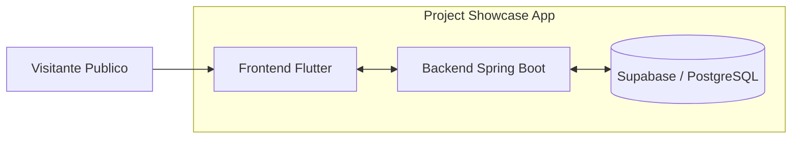
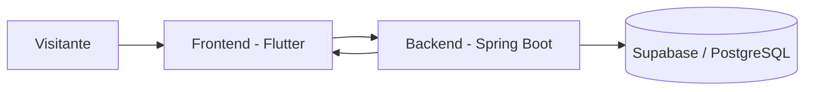
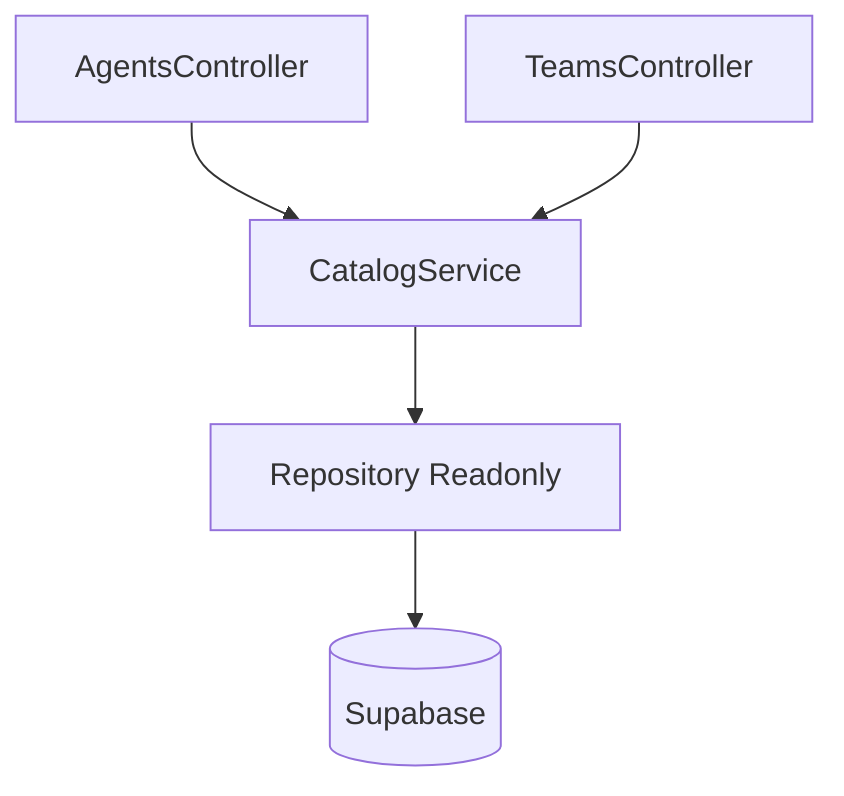
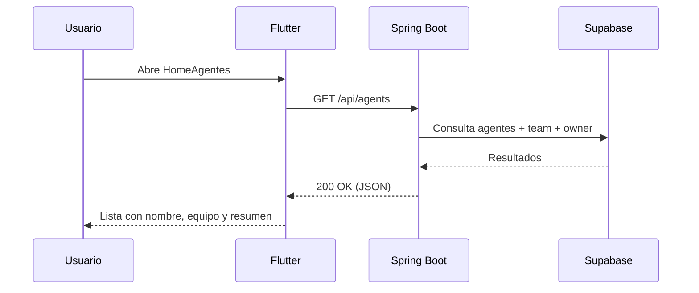
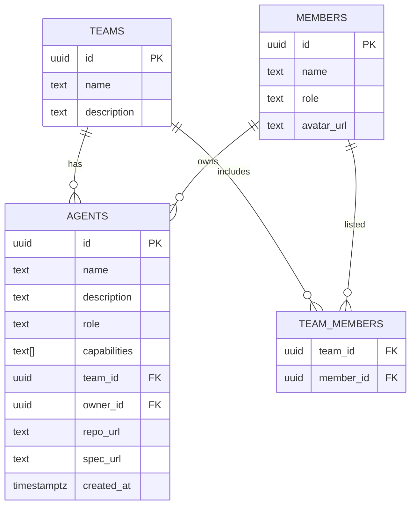
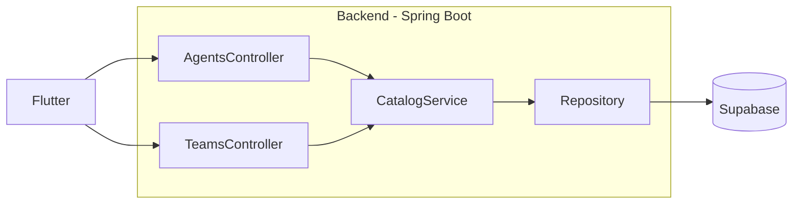
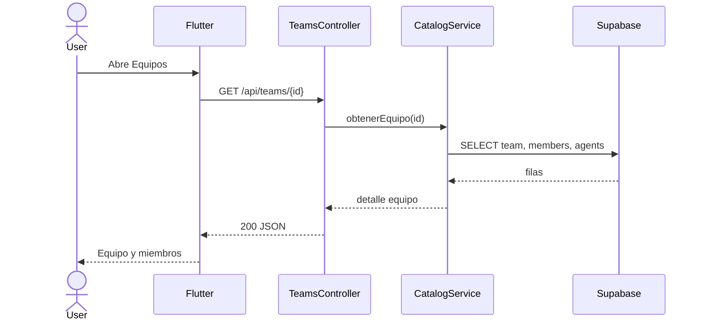

# Project Showcase App — Diseño y Documentación Técnica (MVP)

Autor: Esteban de Santiago García

Fecha: 2025-10-21

Versionado: 1.0

Resumen
- Propósito: Documentar el diseño técnico que habilita el MVP descrito en mvp.md y prd.md.
- Enfoque: simplicidad, claridad y trazabilidad de valor, guiado por los agentes software-architect-agent y software-analyst-agent.
- Alcance: lectura pública de agentes y equipos; sin autenticación, sin CRUD.

1. Visión y Alcance
- Lo que entregamos: navegación pública para explorar agentes y equipos, con vistas de lista y detalle.
- Lo que no entregamos en MVP: métricas individuales, videos, explorador de carpetas, login.
- Métrica de éxito: usuarios pueden descubrir y entender agentes y equipos con fluidez.

2. Arquitectura (alto nivel)
- Frontend: Flutter (web/móvil) consumiendo API REST.
- Backend: Spring Boot (read-only), orquestando datos de Supabase (PostgreSQL).
- Datos: esquema mínimo para agents, teams, members, team_members.
- Errores: formato uniforme { code, message }.

3. C4 — Contexto (Mermaid)

4. C4 — Contenedores (Mermaid)

5. Componentes Backend (Mermaid)

6. Secuencia — Ver lista de agentes (Mermaid)

7. Modelo de Datos (ERD, Mermaid)

8. Contrato de API (resumen)
- GET /api/agents
  - 200: [{ id, name, description: short, team:{ id, name }, owner:{ id, name, role } }]
- GET /api/agents/{id}
  - 200: { id, name, description, role, capabilities, team, owner, repoUrl, specUrl }
- GET /api/teams
  - 200: [{ id, name, agentsCount }]
- GET /api/teams/{id}
  - 200: { id, name, description, members:[{ id, name, role }], agents:[{ id, name }] }
- Errores
  - Ejemplo: 404 { code:"NOT_FOUND", message:"Agente no encontrado" }

Notas de claridad
- description short: truncado controlado (p. ej. 140 chars) para tarjetas de lista.
- Consistencia nombres: snake_case en BD; camelCase en API.

9. NFRs esenciales (MVP)
- Desempeño: p95 < 500ms para listados; primeras cargas simples.
- Disponibilidad: >= 99% durante demo.
- Accesibilidad: textos legibles y contraste básico.
- Seguridad: CORS restringido; entradas sanitizadas; no PII sensible.
- Observabilidad: logs estructurados; trazas de petición; manejo uniforme de errores.

10. Estados de UX (alineado al Analista)
- Cargando: skeleton o spinner breve.
- Vacío: mensaje claro y acción de reintento.
- Error: mensaje entendible y reintento; registro técnico en backend.

11. Decisiones de Arquitectura (resumen ADR)
- ADR-001: API read-only en MVP para reducir complejidad y tiempo.
- ADR-002: Supabase como fuente de datos por rapidez de integración.
- ADR-003: Unificar error { code, message } para DX y trazabilidad.
- ADR-004: Separación Controller/Service/Repository para claridad y pruebas.

12. Trazabilidad (PO/Analista → Técnica)
- HU-1.1, HU-1.2, HU-1.3 → /api/agents, /api/agents/{id}
- HU-2.1, HU-2.2, HU-2.3 → /api/teams, /api/teams/{id}
- Mensajes de estado y navegación → lineamientos de UX del Analista.

13. Riesgos y Mitigaciones
- Datos incompletos: sembrar datasets mínimos (3 equipos, 5 agentes, 6 miembros).
- Cambios de alcance: contratos versionados y story mapping visible.
- Rendimiento: consultas enfocadas (select específicos, joins mínimos).

14. Roadmap técnico del MVP
- S1: Esquema de datos y contrato de API (borrador) + esqueleto FE.
- S2: Lista/detalle Agentes + errores y estados.
- S3: Lista/detalle Equipos + ficha desarrollador.
- S4: Hardening, QA y documentación final.

Anexo A — Diagramas adicionales (Mermaid)

Anexo B — Referencias
- mvp.md, prd.md
- software-architect-agent.xml, software-analyst-agent.xml
- Principios guía: simplicidad, claridad, observabilidad, trazabilidad.
